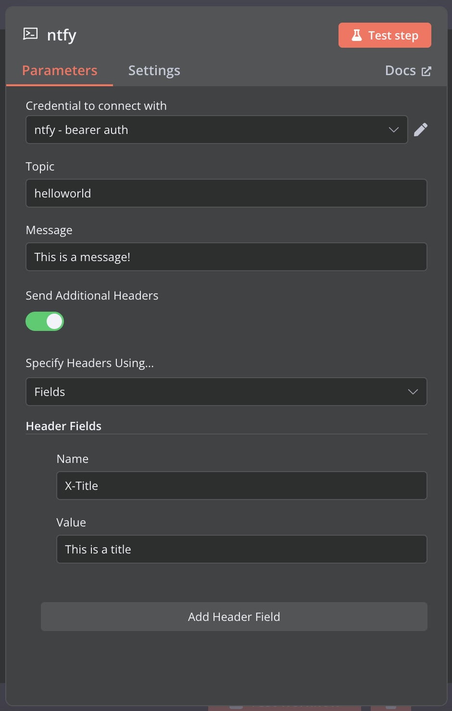

# @ivov/n8n-nodes-ntfy

[n8n community package](https://docs.n8n.io/integrations/community-nodes/installation/gui-install/) to push messages via [ntfy.sh](https://ntfy.sh/)

- Set headers via fields or JSON
- Support for self-hosted ntfy instances
- Credentials for basic + bearer + query auth

## Docs

- [`development.md`](docs/development.md)
- [`self-hosting.md`](docs/self-hosting.md)
